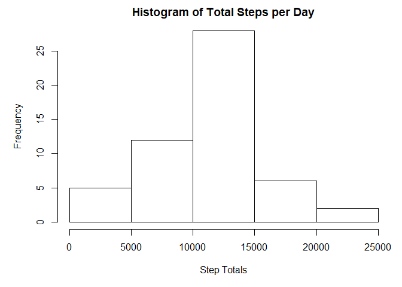
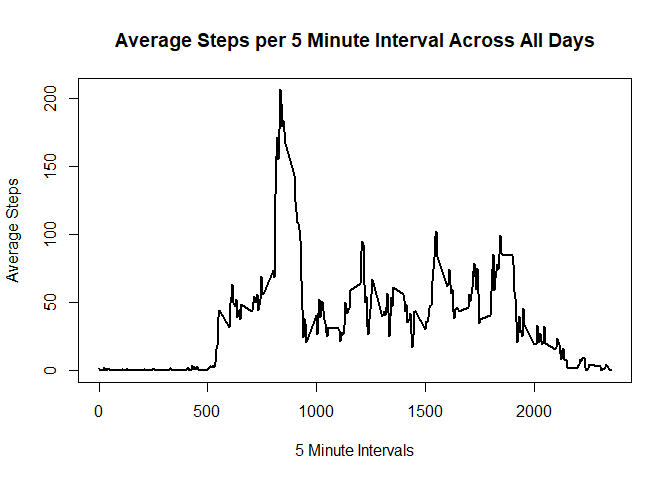
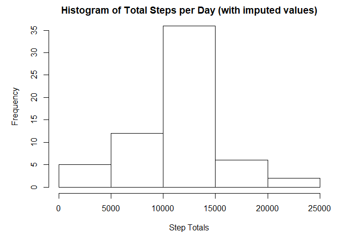
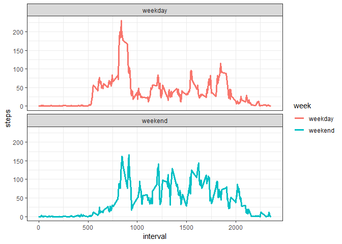

### Loading and preprocessing the data

First, the dataset is read in from the working directory.  Any relevant libraries are also loaded.


```r
library(readr)
library(dplyr)
```

```
## 
## Attaching package: 'dplyr'
```

```
## The following objects are masked from 'package:stats':
## 
##     filter, lag
```

```
## The following objects are masked from 'package:base':
## 
##     intersect, setdiff, setequal, union
```

```r
library(ggplot2)
activity <- read_csv("activity.csv")
```

```
## Parsed with column specification:
## cols(
##   steps = col_integer(),
##   date = col_date(format = ""),
##   interval = col_integer()
## )
```

Then the dataset is evaluated to see if preprocessing is necessary prior to initial analysis.  
It's a straightforward dataset with 3 variables with clear names and 17568 rows.  
Although the dataset contains NAs, these can be ignored for the first few steps.


### What is the mean total number of steps taken per day?

Find the total number of steps taken for each day.


```r
dailysteps <- aggregate(steps ~ date, activity, sum, na.rm = TRUE)
```

Make a histogram of the total number of steps taken per day:


```r
par(mar = c(5, 5, 2, 1))
hist(dailysteps$steps, 
     main = "Histogram of Total Steps per Day", 
     xlab = "Step Totals")
```

<!-- -->

Calculate and report the mean and median of the total number of steps taken per day.


```r
meanSteps <- mean(dailysteps$steps)
medianSteps <- median(dailysteps$steps)
meanStepsNum <- format(meanSteps, scientific = FALSE)
medianStepsNum <- format(medianSteps, scientific = FALSE)
```

The mean number of steps taken per day is 10766.19.  
The median number of steps taken per day is 10765.


### What is the average daily activity pattern?

Find average number of steps per interval, collapsed across all days.


```r
intervalSteps <- aggregate(cbind(steps, date) ~ interval, activity, mean, na.rm = TRUE)
```

Show the time series plot as a line graph:


```r
with(intervalSteps, plot(interval, steps, type = "l", lwd = 2,
                         xlab = "5 Minute Intervals", 
                         ylab = "Average Steps",
                         main = "Average Steps per 5 Minute Interval Across All Days"))
```

<!-- -->


```r
maxInterval <- which(intervalSteps$steps == max(intervalSteps$steps))
maxInt <- intervalSteps$interval[maxInterval]
```

The 5-minute interval with the highest average number of steps is 835.


### Imputing missing values

Determine the total number of missing values in the dataset.


```r
missing <- sum(is.na(activity$steps))
```

There are 2304 NAs in the steps column.

The selected strategy to impute the missing values is to replace NAs with the mean for that interval.


```r
activity$meanSteps <- intervalSteps$steps[match(activity$interval, intervalSteps$interval)]
activity$steps1 <- for (i in 1:17568) {
      if(is.na(activity$steps[i])) { 
        activity$steps[i] <- activity$meanSteps[i]
      }
}
```

Calculate the new daily step totals with imputed valued included.

Make a histogram of the updated total number of steps taken each day.


```r
dailystepsImputed <- aggregate(cbind(steps, interval, meanSteps) ~ date, 
                               activity, sum, na.rm = TRUE)
par(mar = c(5, 5, 2, 1))
hist(dailystepsImputed$steps, 
     main = "Histogram of Total Steps per Day (with imputed values)", 
     xlab = "Step Totals")
```

<!-- -->

Calculate and report the mean and median of the total number of steps taken per day, including imputed values.


```r
meanStepsImputed <- mean(dailystepsImputed$steps)
medianStepsImputed <- median(dailystepsImputed$steps)
meanStepsImpNum <- format(meanStepsImputed, scientific = FALSE)
medianStepsImpNum <- format(medianStepsImputed, scientific = FALSE)
```

The mean number of steps taken per day, including imputed values, is 10766.19.  
The median number of steps taken per day, including imputed values, is 10766.19.

These numbers are basically identical to the previous numbers due to the use of the interval means to replace the NAs.  The imputed values biased the data toward the mean/median (the center bar of the histogram gets noticeably taller while the other bars get a little shorter).


### Are there differences in activity patterns between weekdays and weekends?

Add a new factor variable to the dataset (with imputed valued) - two levels, "weekday" and "weekend".  


```r
fullActivity <- activity[, 1:3]
fullActivity$date <- weekdays(fullActivity$date)
weekend <- c("Saturday", "Sunday")
fullActivity$week <- ifelse(fullActivity$date %in% weekend, "weekend", "weekday")
```

Find the means of steps by interval, grouped by weekend and weekday.


```r
intervalSteps2 <- aggregate(steps ~ interval + week, fullActivity, mean)
```

Show the line graphs of mean steps per interval for weekday and weekend as a two row panel graph:


```r
g <- ggplot(intervalSteps2, aes(interval, steps))
p <- g + geom_line(aes(color = week), size = 1.2) + facet_wrap(week~., nrow = 2) + theme_bw()
print(p)
```

<!-- -->

Weekdays have an earlier rise in activity around 5:30 am and a higher spike of activity between 8 and 9am than weekends, but weekends show more consistent activity all day during waking hours.


